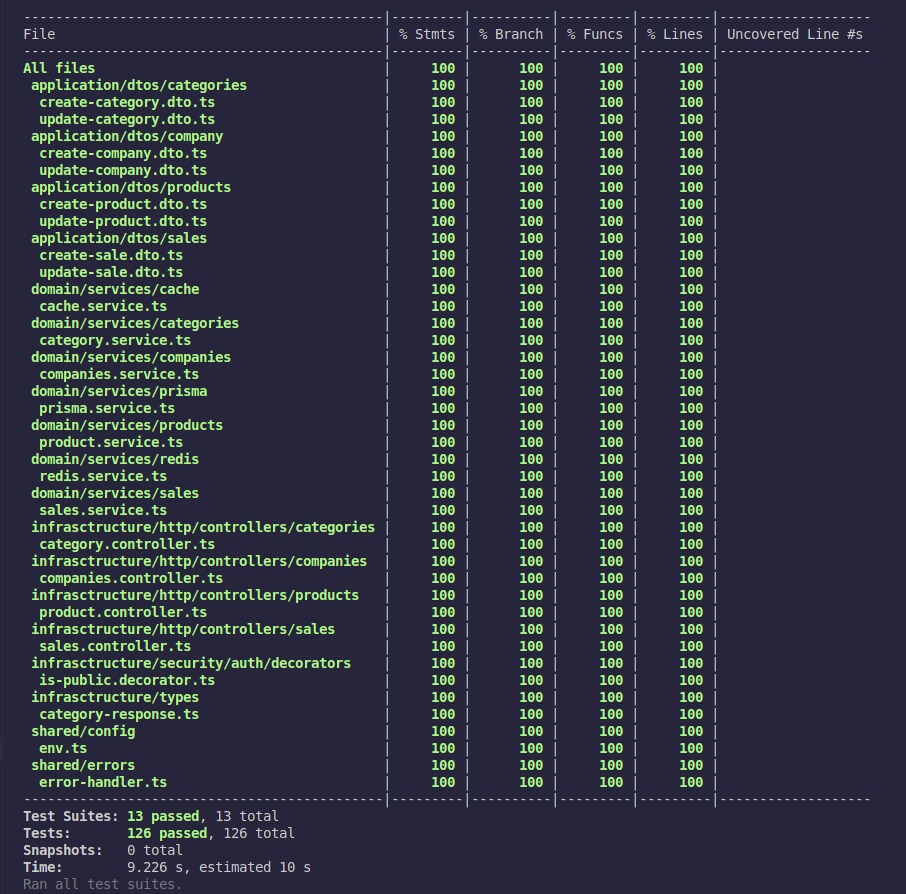

<h1 align="left">Sobre o projeto SfTech</h1>

###

Este é um projeto pessoal de e-commerce, onde utilizei Clean Architecture, Clean Code e as melhores práticas para desenvolvimento backend. O projeto foi construído com Nest.js, Prisma ORM e Jest, garantindo uma estrutura robusta, escalável e completamente testada

## Demonstração:

 
Este backend faz parte do projeto portifólio Sf-tech, veja mais em https://sf-tech-front.vercel.app/

## Cobertura de testes 100%:

  
  
## 🛠 Tecnologias utilizadas

<h2 align="left">O backend foi desenvolvido com as seguintes tecnologias principais:</h2>

Nest.js – Framework para aplicações Node.js escaláveis e modulares.

Prisma ORM – ORM moderno para manipulação eficiente do banco de dados.

Jest – Framework de testes para garantir alta cobertura de código.

Redis – Cache eficiente para otimizar a performance da aplicação.

TypeScript – Tipagem estática para um código mais seguro e robusto.

Outras bibliotecas importantes incluem: Passport.js (autenticação), Class-Validator (validações), Axios (requisições HTTP), Swagger (documentação da API), Cache Manager, UUID, e muito mais.

## ▶️ Rodando o projeto localmente:

### 📌 Instalação das dependências

yarn install

### 🔥 Executando o Redis

redis-server

### 🏃 Iniciando o servidor

yarn dev

## 📜 Licença

Este projeto está sob a licença MIT.

Feito com 💖 por Silvio Félix.

Obrigado! 🌠
