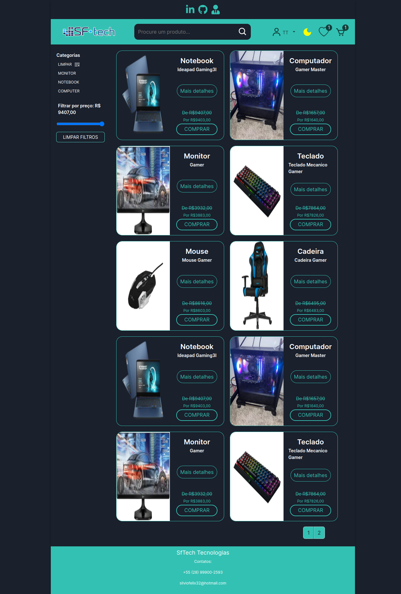

<h1 align="left">Sobre o projeto SfTech</h1>

###

Esse é um projeto pessoal de um e-commerce usando a melhor parte de minhas habilidades no backend até o momento...

## Demonstração:

  
  
###

<h2 align="left">Esse backend foi feito usando:</h2>
###

  
  
  
  
  
  
  
  
  

###

## Dependencies

- [@nest/axios](https://github.com/nestjs/axios#readme): Nest - modern, fast, powerful node.js web framework (@axios)
- [@nestjs/cache-manager](https://github.com/nestjs/cache-manager#readme): Nest - modern, fast, powerful node.js web framework 
- [@nestjs/core](https://github.com/nestjs/jwt#readme): Nest - modern, fast, powerful node.js web framework 
- [@nestjs/jwt](https://github.com/nestjs/jwt#readme): Nest - modern, fast, powerful node.js web framework 
- [@nestjs/mapped-types](https://github.com/nestjs/jwt#readme): Nest - modern, fast, powerful node.js web framework 
- [@nestjs/passport](https://github.com/nestjs/jwt#readme): Nest - modern, fast, powerful node.js web framework 
- [@nestjs/latform-express](https://github.com/nestjs/jwt#readme): Nest - modern, fast, powerful node.js web framework 
- [@nestjs/swagger](https://github.com/nestjs/jwt#readme): Nest - modern, fast, powerful node.js web framework 
- [@prisma/client](https://www.prisma.io): Prisma Client is an auto-generated, type-safe and modern JavaScript/TypeScript ORM for Node.js that's tailored to your data. Supports MySQL, PostgreSQL, MariaDB, SQLite databases.
- [bcrypt](https://github.com/kelektiv/node.bcrypt.js#readme):  A bcrypt library for NodeJS.
- [bcryptjs](https://github.com/dcodeIO/bcrypt.js#readme): Optimized bcrypt in plain JavaScript with zero dependencies. 
- [cache-manager](https://github.com/node-cache-manager/node-cache-manager#readme): Cache module for Node.js.
- [cache-manager-redis-store](https://github.com/dabroek/node-cache-manager-redis-store#readme): Redis store for node-cache-manager.
- [class-transformer](https://github.com/typestack/class-transformer#readme): Proper decorator-based transformation / serialization / deserialization of plain javascript objects to class constructors.
- [class-validator](https://github.com/typestack/class-validator#readme): Decorator-based property validation for classes.
- [cors](https://github.com/expressjs/cors#readme): Node.js CORS middleware.
- [passport](https://www.passportjs.org/): Simple, unobtrusive authentication for Node.js.
- [passport-jwt](https://github.com/mikenicholson/passport-jwt): Passport authentication strategy using JSON Web Tokens.
- [passport-local](https://www.react-hook-form.com): Local username and password authentication strategy for Passport.
- [prisma-pagination](https://github.com/enkot/prisma-pagination#readme): Pagination.
- [redis](https://github.com/redis/node-redis): A modern, high performance Redis client.
- [swagger-ui-express](https://github.com/scottie1984/swagger-ui-express): Swagger UI Express.
- [uuid](https://github.com/uuidjs/uuid#readme):RFC4122 (v1, v4, and v5) UUIDs.

# :page_facing_up: License

This project is under the [MIT license](./LICENSE).
Made with 💖 by [Silvio Félix](https://www.linkedin.com/in/silviofelix32/).

Thank you! 🌠

###
